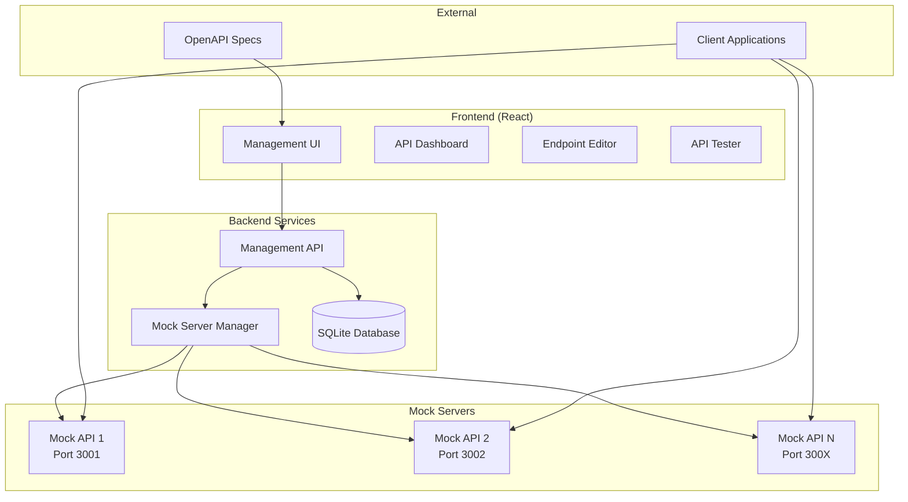

# Design Document

## Overview

The API mocking service is a full-stack web application that enables developers to create, manage, and test mock APIs. The system consists of a React-based frontend for configuration and management, a Node.js backend for API orchestration, and a dynamic mock server system that spawns individual servers for each mock API on dedicated ports.

The architecture follows a monorepo structure with clear separation between the management interface and the actual mock servers, allowing for scalable and isolated API mocking.

## Architecture

### High-Level Architecture



### Technology Stack

- **Frontend**: React with TypeScript, Tailwind CSS, ShadCN components
- **Routing**: TanStack Router with file-based routing and official Vite plugin
- **Data Fetching**: TanStack Query with reusable queryOptions
- **Backend**: Node.js with Express, TypeScript
- **Mock Servers**: Hono for lightweight individual mock servers
- **Database**: SQLite with Drizzle ORM for type-safe database interactions
- **Communication**: oRPC for type-safe frontend-backend communication
- **Validation**: Zod schemas for request/response validation
- **Build Tools**: Vite for frontend, standard Node.js tooling for backend
- **Package Manager**: pnpm

## Components and Interfaces

### Frontend Components

#### Core Components
- **ApiDashboard**: Main dashboard showing all mock APIs with status indicators
- **ApiEditor**: Form for creating/editing API configurations
- **EndpointEditor**: Interface for configuring individual endpoints and scenarios
- **ScenarioEditor**: Component for editing response scenarios
- **ApiTester**: Built-in testing interface for endpoints
- **OpenApiImporter**: Component for uploading and processing OpenAPI files
- **LogViewer**: Interface for viewing request/response logs

#### Routing Structure (TanStack Router)
File-based routing with the following structure:
- `/` - Dashboard route showing all APIs
- `/apis/new` - Create new API
- `/apis/$apiId` - API details and endpoint management
- `/apis/$apiId/endpoints/$endpointId` - Endpoint configuration
- `/apis/$apiId/test` - API testing interface
- `/apis/$apiId/logs` - Request logs for specific API

#### Data Fetching (TanStack Query)
Reusable queryOptions for consistent data fetching:
- `apisQueryOptions` - Fetch all APIs with status
- `apiQueryOptions(id)` - Fetch specific API with endpoints
- `endpointsQueryOptions(apiId)` - Fetch endpoints for an API
- `scenariosQueryOptions(endpointId)` - Fetch scenarios for endpoint
- `logsQueryOptions(apiId, filters)` - Fetch request logs with filtering
- `openApiImportMutation` - Handle OpenAPI file imports

#### Shared Components
- **StatusIndicator**: Shows API active/inactive status
- **PortDisplay**: Shows assigned port numbers
- **JsonEditor**: Code editor for JSON payloads
- **HttpMethodSelector**: Dropdown for HTTP methods
- **ResponseCodeSelector**: Input for HTTP status codes

### Backend Services

#### Management API Service
Handles CRUD operations for APIs, endpoints, and scenarios.

**Key Endpoints:**
- `GET /apis` - List all mock APIs
- `POST /apis` - Create new mock API
- `PUT /apis/:id` - Update mock API
- `DELETE /apis/:id` - Delete mock API
- `POST /apis/:id/start` - Start mock server
- `POST /apis/:id/stop` - Stop mock server
- `GET /apis/:id/endpoints` - List endpoints for API
- `POST /apis/:id/endpoints` - Create endpoint
- `PUT /endpoints/:id` - Update endpoint
- `DELETE /endpoints/:id` - Delete endpoint
- `POST /openapi/import` - Import OpenAPI specification

#### Mock Server Manager Service
Manages the lifecycle of individual mock servers.

**Responsibilities:**
- Port allocation and management
- Spawning/terminating mock server processes
- Health monitoring of mock servers
- Request routing and logging

#### Individual Mock Servers
Lightweight Hono servers that handle actual mock requests.

**Features:**
- Route matching based on endpoint configuration
- Scenario selection logic
- Request/response logging
- Error handling for unmatched routes
- High-performance request handling with Hono's optimized routing

## Data Models

### Core Entities

```typescript
// API Configuration
interface MockApi {
  id: string;
  name: string;
  description: string;
  port: number;
  status: 'active' | 'inactive';
  createdAt: Date;
  updatedAt: Date;
  endpoints: Endpoint[];
}

// Endpoint Configuration
interface Endpoint {
  id: string;
  apiId: string;
  method: HttpMethod;
  path: string;
  description?: string;
  requestHeaders?: Record<string, string>;
  requestParams?: Record<string, string>;
  requestBody?: any;
  scenarios: Scenario[];
  defaultScenarioId: string;
  createdAt: Date;
  updatedAt: Date;
}

// Response Scenario
interface Scenario {
  id: string;
  endpointId: string;
  name: string;
  statusCode: number;
  responseHeaders?: Record<string, string>;
  responseBody?: any;
  conditions?: ScenarioCondition[];
  isDefault: boolean;
  createdAt: Date;
  updatedAt: Date;
}

// Scenario Conditions
interface ScenarioCondition {
  type: 'header' | 'query' | 'body';
  key: string;
  operator: 'equals' | 'contains' | 'exists';
  value?: string;
}

// Request Log
interface RequestLog {
  id: string;
  apiId: string;
  endpointId?: string;
  scenarioId?: string;
  method: string;
  path: string;
  requestHeaders: Record<string, string>;
  requestBody?: any;
  responseStatus: number;
  responseHeaders: Record<string, string>;
  responseBody?: any;
  timestamp: Date;
  duration: number;
}

type HttpMethod = 'GET' | 'POST' | 'PUT' | 'DELETE' | 'PATCH' | 'HEAD' | 'OPTIONS';
```

### Database Schema (Drizzle)

```typescript
// Drizzle schema definitions
import { sqliteTable, text, integer, uniqueIndex } from 'drizzle-orm/sqlite-core';
import { relations } from 'drizzle-orm';

export const apis = sqliteTable('apis', {
  id: text('id').primaryKey(),
  name: text('name').notNull(),
  description: text('description'),
  port: integer('port').notNull().unique(),
  status: text('status', { enum: ['active', 'inactive'] }).default('inactive'),
  createdAt: integer('created_at', { mode: 'timestamp' }).notNull().$defaultFn(() => new Date()),
  updatedAt: integer('updated_at', { mode: 'timestamp' }).notNull().$defaultFn(() => new Date()),
});

export const endpoints = sqliteTable('endpoints', {
  id: text('id').primaryKey(),
  apiId: text('api_id').notNull().references(() => apis.id, { onDelete: 'cascade' }),
  method: text('method').notNull(),
  path: text('path').notNull(),
  description: text('description'),
  requestHeaders: text('request_headers', { mode: 'json' }),
  requestParams: text('request_params', { mode: 'json' }),
  requestBody: text('request_body', { mode: 'json' }),
  defaultScenarioId: text('default_scenario_id'),
  createdAt: integer('created_at', { mode: 'timestamp' }).notNull().$defaultFn(() => new Date()),
  updatedAt: integer('updated_at', { mode: 'timestamp' }).notNull().$defaultFn(() => new Date()),
}, (table) => ({
  uniqueEndpoint: uniqueIndex('unique_endpoint').on(table.apiId, table.method, table.path),
}));

export const scenarios = sqliteTable('scenarios', {
  id: text('id').primaryKey(),
  endpointId: text('endpoint_id').notNull().references(() => endpoints.id, { onDelete: 'cascade' }),
  name: text('name').notNull(),
  statusCode: integer('status_code').notNull(),
  responseHeaders: text('response_headers', { mode: 'json' }),
  responseBody: text('response_body', { mode: 'json' }),
  conditions: text('conditions', { mode: 'json' }),
  isDefault: integer('is_default', { mode: 'boolean' }).default(false),
  createdAt: integer('created_at', { mode: 'timestamp' }).notNull().$defaultFn(() => new Date()),
  updatedAt: integer('updated_at', { mode: 'timestamp' }).notNull().$defaultFn(() => new Date()),
});

export const requestLogs = sqliteTable('request_logs', {
  id: text('id').primaryKey(),
  apiId: text('api_id').notNull().references(() => apis.id, { onDelete: 'cascade' }),
  endpointId: text('endpoint_id').references(() => endpoints.id),
  scenarioId: text('scenario_id').references(() => scenarios.id),
  method: text('method').notNull(),
  path: text('path').notNull(),
  requestHeaders: text('request_headers', { mode: 'json' }).notNull(),
  requestBody: text('request_body', { mode: 'json' }),
  responseStatus: integer('response_status').notNull(),
  responseHeaders: text('response_headers', { mode: 'json' }).notNull(),
  responseBody: text('response_body', { mode: 'json' }),
  timestamp: integer('timestamp', { mode: 'timestamp' }).notNull().$defaultFn(() => new Date()),
  duration: integer('duration'), // milliseconds
});

// Relations
export const apisRelations = relations(apis, ({ many }) => ({
  endpoints: many(endpoints),
  requestLogs: many(requestLogs),
}));

export const endpointsRelations = relations(endpoints, ({ one, many }) => ({
  api: one(apis, { fields: [endpoints.apiId], references: [apis.id] }),
  scenarios: many(scenarios),
  requestLogs: many(requestLogs),
}));

export const scenariosRelations = relations(scenarios, ({ one }) => ({
  endpoint: one(endpoints, { fields: [scenarios.endpointId], references: [endpoints.id] }),
}));
```

## Error Handling

### Frontend Error Handling
- **Network Errors**: Display user-friendly messages for connection issues
- **Validation Errors**: Show inline validation messages for form fields
- **API Errors**: Parse and display backend error messages
- **File Upload Errors**: Specific messaging for OpenAPI import failures

### Backend Error Handling
- **Validation Errors**: Use Zod schemas to validate all inputs
- **Database Errors**: Handle constraint violations and connection issues
- **Port Conflicts**: Detect and resolve port allocation conflicts
- **Mock Server Errors**: Handle server startup/shutdown failures
- **OpenAPI Parsing Errors**: Provide detailed feedback on specification issues

### Mock Server Error Handling
- **Route Not Found**: Return structured 404 responses
- **Scenario Evaluation Errors**: Fallback to default scenarios
- **Response Generation Errors**: Log errors and return 500 with details
- **Request Parsing Errors**: Handle malformed requests gracefully

## Testing Strategy

### Unit Testing
- **Frontend Components**: Test component rendering and user interactions
- **Backend Services**: Test business logic and data operations
- **Utility Functions**: Test OpenAPI parsing, port allocation, scenario matching
- **Database Operations**: Test CRUD operations and constraints

### Integration Testing
- **API Endpoints**: Test complete request/response cycles
- **Mock Server Lifecycle**: Test server creation, startup, and shutdown
- **OpenAPI Import**: Test end-to-end import process
- **Scenario Execution**: Test scenario selection and response generation

### End-to-End Testing
- **User Workflows**: Test complete user journeys from API creation to testing
- **Mock API Functionality**: Test actual HTTP requests to mock servers
- **Multi-API Scenarios**: Test multiple APIs running simultaneously
- **Error Scenarios**: Test error handling across the entire system

### Performance Testing
- **Concurrent Requests**: Test mock servers under load
- **Memory Usage**: Monitor resource usage with multiple APIs
- **Database Performance**: Test with large numbers of APIs and logs
- **Port Management**: Test port allocation/deallocation efficiency

## Security Considerations

### Input Validation
- Validate all user inputs using Zod schemas
- Sanitize file uploads (OpenAPI specs)
- Prevent path traversal in endpoint paths
- Validate JSON payloads for scenarios

### Port Security
- Restrict port range to safe values (3001-4999, 5001-9999) - avoiding port 5000 (macOS AirPlay)
- Prevent binding to system ports (0-1023)
- Handle port conflicts gracefully
- Monitor for unauthorized port usage

### Data Protection
- Sanitize logs to prevent sensitive data exposure
- Implement request size limits
- Validate response payloads before serving
- Secure database file permissions

### Access Control
- Consider adding authentication for production deployments
- Implement rate limiting for mock servers
- Log access attempts for monitoring
- Provide configuration for security headers

## Deployment Architecture

### Development Mode
- Single process running both management API and frontend dev server
- Mock servers spawned as child processes
- SQLite database in project directory
- Hot reloading for development

### Production Mode
- Separate processes for frontend (static files) and backend API
- Process manager (PM2) for mock server management
- Persistent SQLite database with backups
- Reverse proxy (nginx) for routing
- Docker containerization support

### Configuration Management
- Environment variables for port ranges, database location
- Configuration files for default settings
- Runtime configuration through management API
- Health check endpoints for monitoring